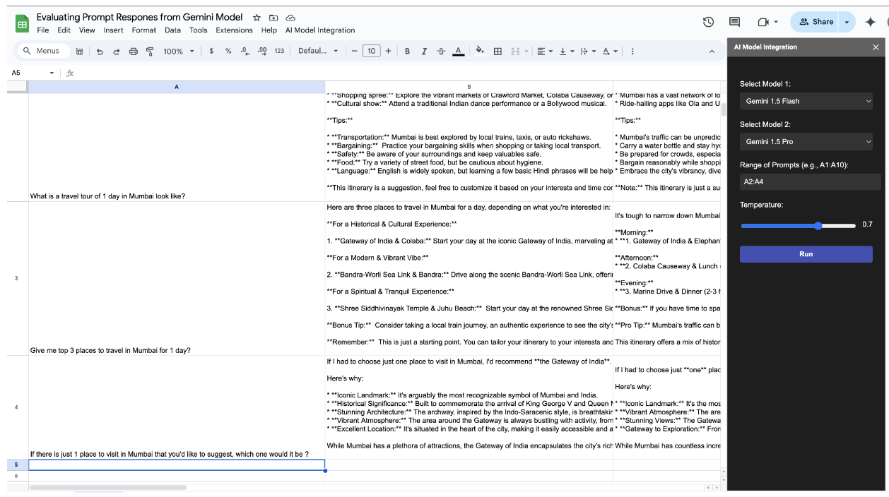

This is a Google Sheet Add-on that allow you to invoke the Gemini Flash and Gemini Pro flows that were setup on Cloud Run. You can provide a list of Prompts (A1:A10) and select any of the models (Currently Flash and Gemini only). It will invoke the model and present the responses in the sheet itself. 

If you’d like access to this sheet, make a copy [here](https://docs.google.com/spreadsheets/d/1JHI8ReDMSZsfKlm1DJRSXnUHUI-ZVirWjjCaL9DWPeI/copy).

Here's the application
